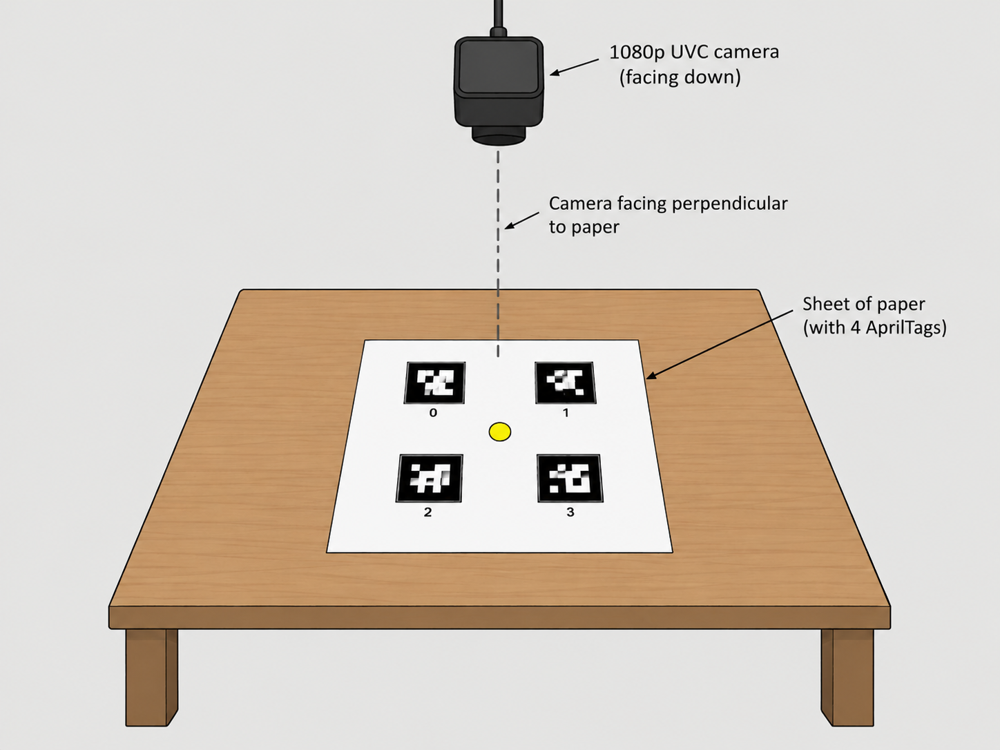
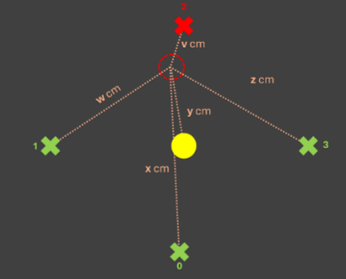

# apriltag-camera-localisation
## Overview
Estimate a camera's 2D pose (x, y, yaw) relative to the nearby AprilTags, and display the pose on an interface. 

Suppose that apriltags are flat on a table and a camera is facing them perpendiculaly. 

\
*Image Generated by ChatGPT*

 

A display similar to the following should be shown to the user 

The red x shows that the indicated apriltag (ID 2) is absent in the camera frame and a green x shows that the indicated apriltag (IDs 0, 1 and 3) is present in the camera frame. The dashed red circle represents the camera's 2D pose, and the yellow circle is a target pose. Estimates of the camera's minimum distance to each apriltag are displayed on the interface in every frame, and the frame updates as each camera frame updates (e.g. 60fps) 

My proposed procedure would look like this:

* Calibration Phase:
  * Capture a set of images of the sheet of paper, showing all apriltags clearly and the target pose
  * Use pupil-apriltags to detect the tags and recover their 6DOF poses relative to the camera
  * Use the  AprilTag's known real-world physical size to establish a pixel-to-real-world scale factor
  * From this, build a static 2D map (a fixed transform) describing the fuel port's position relative to the AprilTags. This transform is computed once and reused instead of taking a map in every frame since the geometry never changes
* Runtime Phase:
  * Track and estimate the camera's pose in each frame using pupil-apriltags
  * The interface regularly updates the apriltag's 2D pose 
